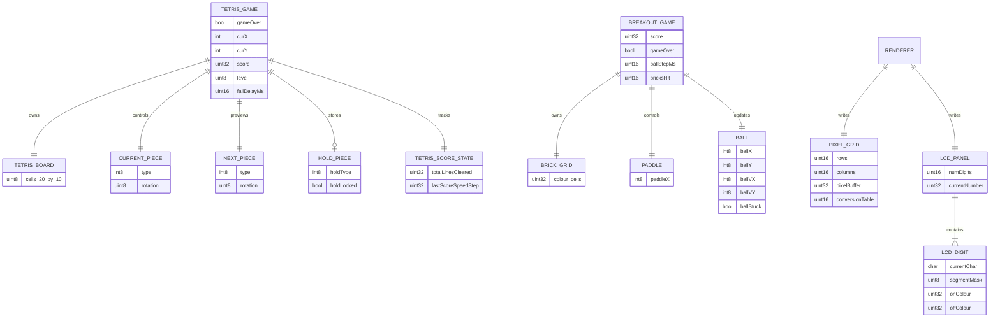

# Database and Storage Design

## 1. Database status

PixelGrid stores runtime state in microcontroller memory while a game is running. Optional score submission sends a score to an external API, but the repository does not include the external backend or its database.

## 2. Storage architecture

### 2.1 Runtime-only storage

The firmware uses volatile in-memory data structures:

- Tetris board, piece, score, level, and timing state in `TetrisGame`.
- Breakout bricks, paddle, ball, score, timers, and game-over state in `Games/Breakout/Game.cpp` and `Game.h`.
- Pixel buffers and LED conversion tables in `Pixel_Grid`.
- LCD digit state in `LCD_Digit` and `LCD_Panel`.
- Input debounce state in Tetris and Breakout input modules.
- Host runtime buffers in `Games/Tetris/HostRuntime.cpp`.

When the device resets or power is lost, this state is lost.

### 2.2 External score storage

`Games/Tetris/NetSubmit.h` submits a signed score to `/api/codes`. The external service may persist submissions or generated codes, but that storage is outside this repository and cannot be documented from local evidence.

### 2.3 Configuration storage

Configuration is compile-time source/header data rather than a database:

- Pin and timing constants are compiled from `Pins.h` files.
- Network/API values are expected from `NetConfig.h`, which is not present.
- Arduino library metadata is stored in `library.properties`.
- CI configuration is stored in YAML under `.github/workflows`.

## 3. In-memory entity descriptions

### 3.1 Tetris entities

| Entity | Fields | Source |
| --- | --- | --- |
| Board | `board[PLAY_H][W]`, where 0 is empty and 1..7 are occupied piece types. | `Games/Tetris/Game.h` |
| Piece | `type`, `rot`. | `Games/Tetris/Game.h` |
| Game status | `gameOver`, `score`, `totalLinesCleared`, `level`, `fallDelayMs`, `lastScoreSpeedStep`, `tFall`. | `Games/Tetris/Game.h` |
| Hold state | `holdType`, `holdLocked`. | `Games/Tetris/Game.h` |
| Colours | `PIECE_COLORS`, `PREVIEW_BG`, `PLAY_BG`, `GHOST_COLOR`. | `Games/Tetris/Game.h`, `Games/Tetris/Render.h` |

### 3.2 Breakout entities

| Entity | Fields | Source |
| --- | --- | --- |
| Brick grid | `bricksGrid[BRICK_H][W]` colour values. | `Games/Breakout/Game.cpp`, `Game.h` |
| Paddle | `paddleX`, configured paddle width and row. | `Games/Breakout/Game.cpp`, `Pins.h` |
| Ball | `ballX`, `ballY`, `ballVX`, `ballVY`, `ballStuck`, `ballStepMs`. | `Games/Breakout/Game.cpp`, `Game.h` |
| Game status | `score`, `gameOver`, `bricksHit`, timing variables. | `Games/Breakout/Game.cpp`, `Game.h` |

### 3.3 Display entities

| Entity | Fields | Source |
| --- | --- | --- |
| Pixel grid | Number of rows/columns, pixel buffer, conversion table, start index, NeoPixel strip pointer. | `libraries/PixelGridcore/src/Pixel_Grid.h` |
| LCD digit | Current digit/character, segment mask, colours, start index. | `libraries/PixelGridcore/src/LCD_Digit.h` |
| LCD panel | Array of six digits, current number, character array, strip pointer. | `libraries/PixelGridcore/src/LCD_Panel.h` |

## 4. ERD-style model for runtime state

## 5. Constraints and indexes

Runtime constraints are enforced procedurally:

- Board dimensions are enforced by checks in Tetris placement validation.
- Breakout paddle and ball positions are constrained by game functions and pin/dimension constants.
- Pixel grid writes depend on logical row/column conversion through `Pixel_Grid`.
- Host packets enforce expected payload lengths before state updates.
- Score submission requires a timestamp and HMAC signature before HTTP POST.
