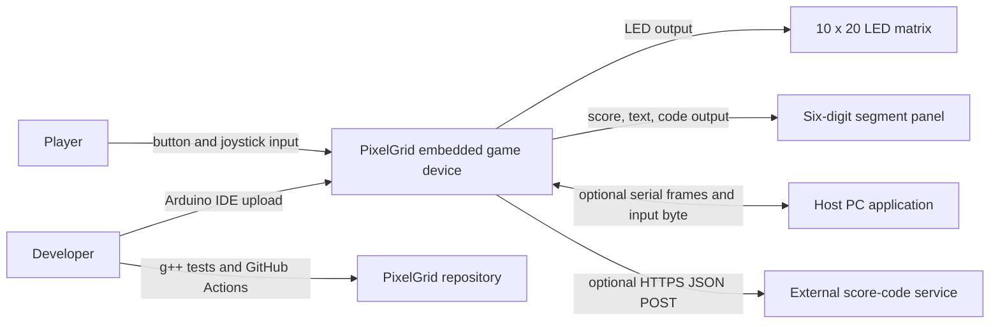
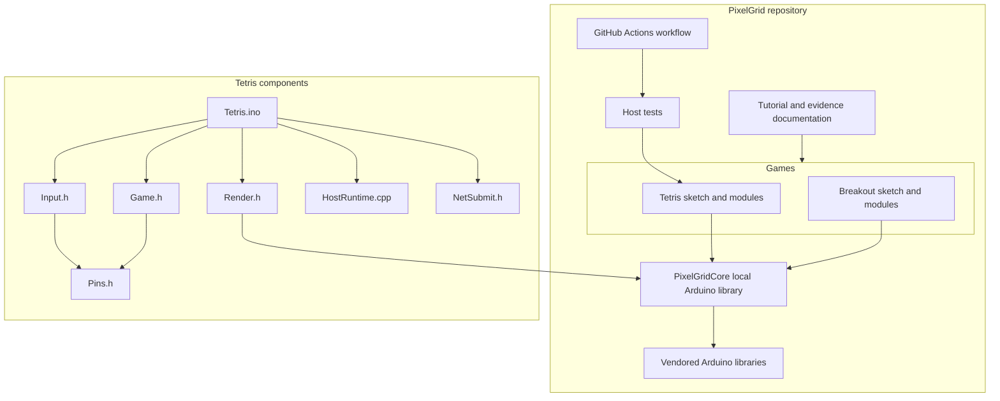
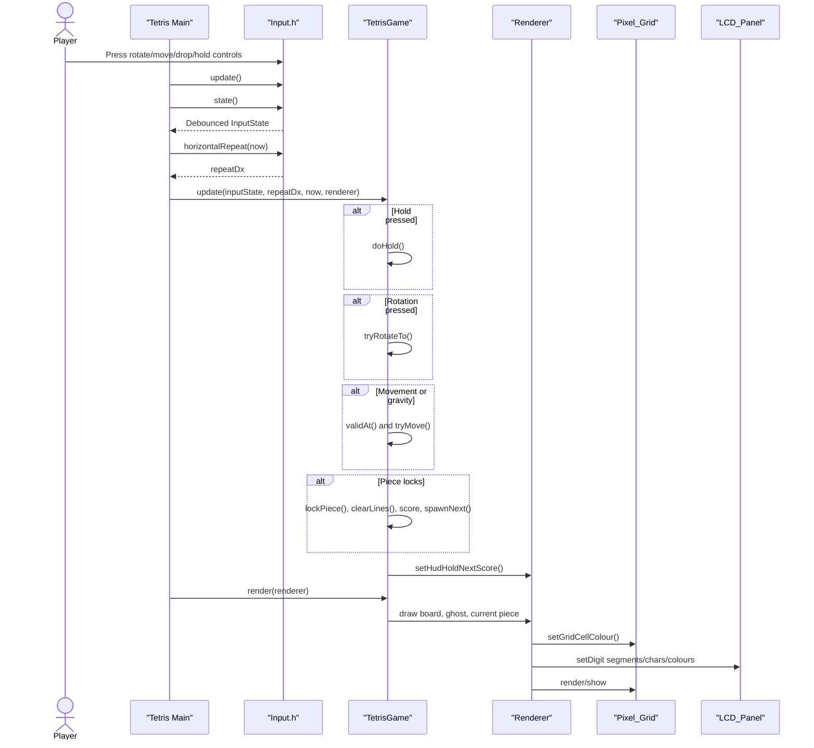
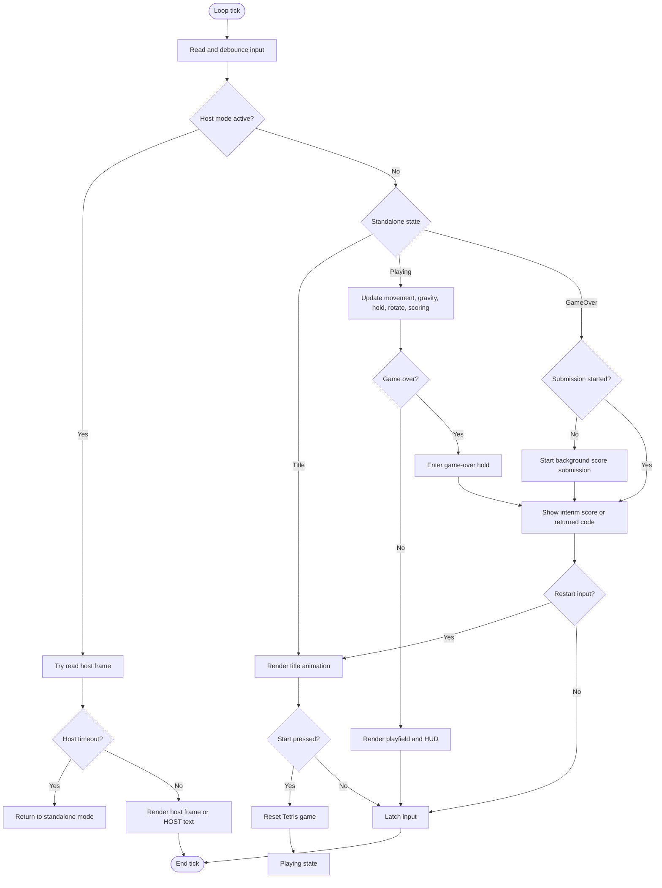
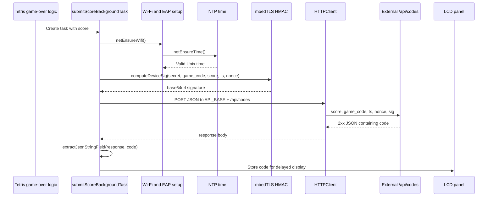
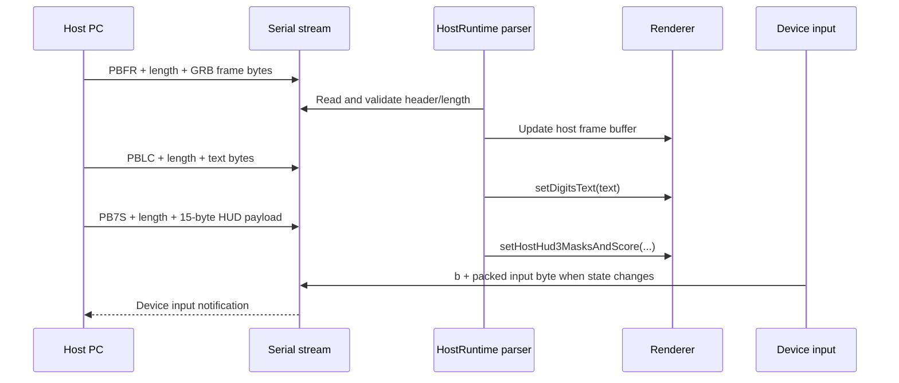
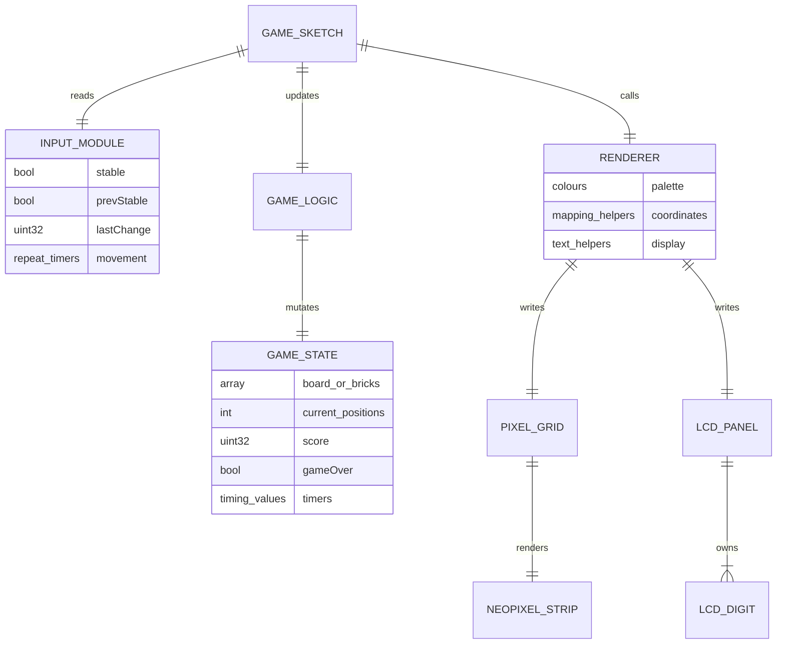
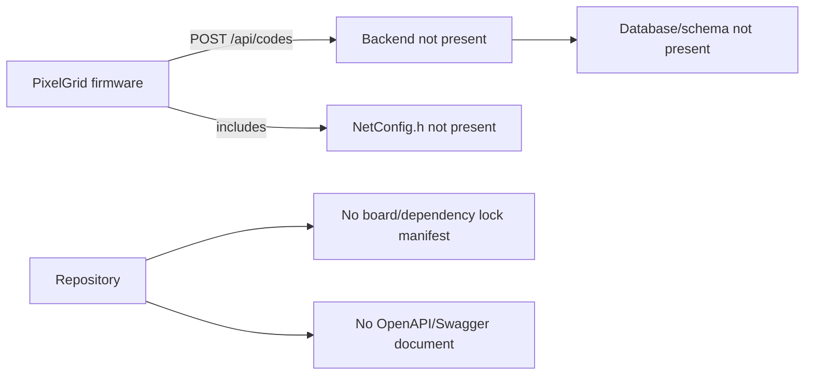

# 06. Modelling and Diagrams

## 1. System context diagram

## 2. Container/component diagram

## 3. Tetris gameplay sequence diagram

## 4. Tetris activity diagram

## 5. Score submission sequence diagram

## 6. Serial host packet flow

## 7. Runtime data model diagram

## 8. Evidence gap diagram

