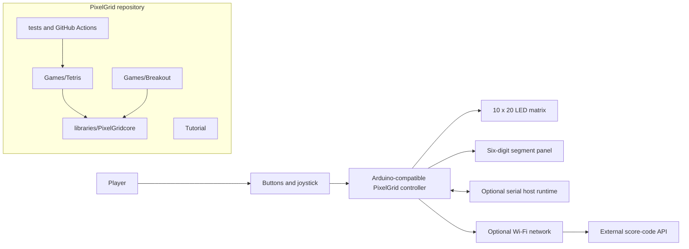
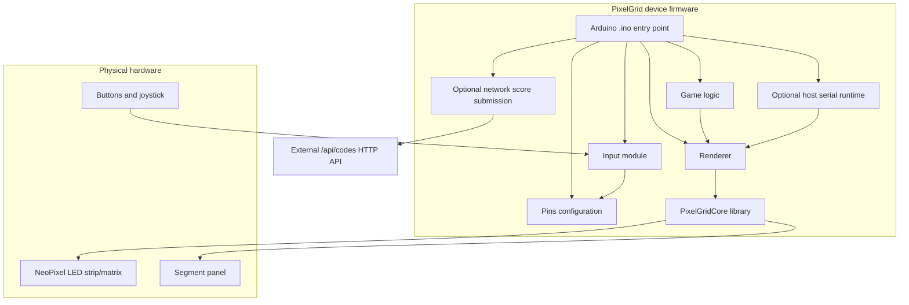
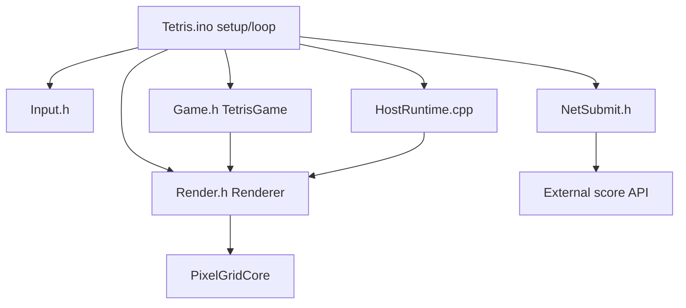
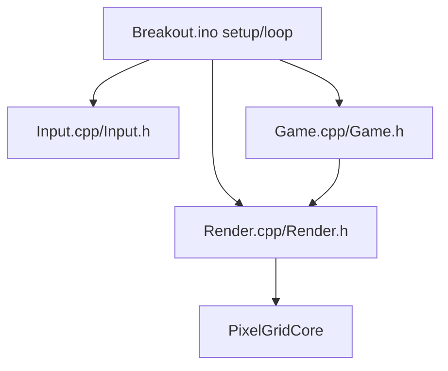
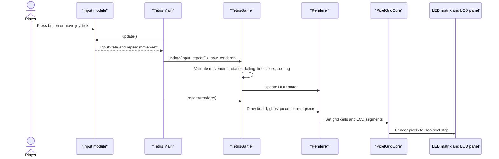
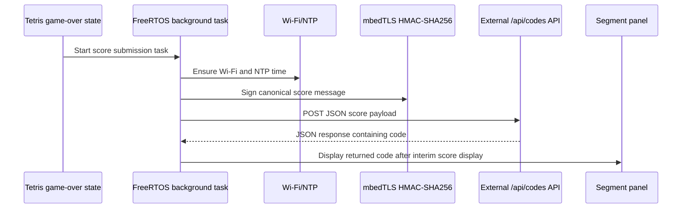

# System Architecture

## 1. Architecture summary

PixelGrid is an embedded Arduino games platform. The primary runtime is a microcontroller connected to an addressable 10x20 matrix, a six-digit LED segment panel, buttons, and a joystick. The codebase is organised around Arduino sketches, game-specific modules, and a local display/input support library.

There is an optional Tetris score submission flow in `Games/Tetris/NetSubmit.h`, which posts JSON to an external HTTP API at `/api/codes`. The backend for that API is not included.

## 2. Frontend and Backend Framework

| Category | Detected evidence |
| --- | --- |
| Frontend framework | No browser/web frontend is present. The user-facing interface is physical: LED matrix, LCD-style segment panel, buttons, and joystick. |
| Backend framework | No backend framework source is present. The repository contains only a client-side embedded HTTP integration in `Games/Tetris/NetSubmit.h`. |
| Embedded framework | Arduino-compatible C++ sketches and libraries. |
| External APIs | Arduino APIs, ESP32 Wi-Fi/HTTP/TLS APIs, mbedTLS, serial packet protocol, and an external `/api/codes` HTTP endpoint. |

## 3. High-level architecture

## 4. Container/component view

## 5. Frontend responsibilities

The project frontend is the embedded physical user interface:

- Buttons and joystick provide input.
- LED matrix displays game state.
- Six-digit segment panel displays score, hold/next indicators, host text, or submission codes.
- Tutorial documentation describes setup and gameplay.

Relevant files:

- Tetris UI and rendering: `Games/Tetris/Render.h`, `Games/Tetris/Tetris.ino`.
- Breakout UI and rendering: `Games/Breakout/Render.cpp`, `Games/Breakout/Breakout.ino`.
- Shared display abstractions: `libraries/PixelGridcore/src/Pixel_Grid.h`, `LCD_Digit.h`, `LCD_Panel.h`.

## 6. Backend responsibilities

No backend implementation is included. The repository contains an embedded client that expects an external score-code service.

From `Games/Tetris/NetSubmit.h`, the embedded client is responsible for:

- Joining a base API URL with `/api/codes`.
- Building a JSON payload with score, game code, timestamp, nonce, and HMAC signature.
- Posting the payload over HTTPS using `HTTPClient` and `WiFiClientSecure`.
- Parsing a `code` string from the JSON response.

The external backend is expected to validate score submissions.

## 7. Module interactions

### Tetris runtime

### Breakout runtime

## 8. Service communication

### 8.1 Hardware communication

- Input: `digitalRead`, `pinMode(INPUT_PULLUP)`, debounce timing, joystick state.
- Output: Adafruit NeoPixel strip updates through `setPixelColor`, PixelGridCore buffers, and render/show calls.

### 8.2 Serial host communication

Tetris supports an optional host runtime. Evidence in `Games/Tetris/HostRuntime.cpp` and `Games/Tetris/Tetris.ino` shows framed serial packets such as:

- LED frame packets beginning with `PBFR`.
- LCD text packets beginning with `PBLC`.
- HUD/segment packets beginning with `PB7S`.
- Device-to-host input payloads beginning with marker byte `b` followed by one packed input byte.

### 8.3 HTTP score communication

`Games/Tetris/NetSubmit.h` posts to `/api/codes` on an externally configured `API_BASE`. The request is signed using HMAC-SHA256 over a canonical message containing `game_code`, `score`, `ts`, and `nonce`.

## 9. Data flow

### Tetris standalone data flow

### Score submission data flow

## 10. Deployment assumptions
- The project is opened as an Arduino Sketchbook root.
- The Arduino IDE discovers local libraries under `libraries`.
- A compatible PixelGrid board or ESP32-style board is connected over USB.
- The LED matrix and segment panel are wired according to the tutorial PDF and setup guides.
- For network score submission, a local `NetConfig.h` must exist and provide values such as `API_BASE`, Wi-Fi/EAP credentials, `GAME_CODE`, and `GAME_SECRET`.
- Host tests require a C++17 compiler and do not require hardware.

## 11. Scalability considerations

### 11.1 Firmware scalability

The current design can scale to additional games by adding new directories under `Games` that reuse `PixelGridCore`. The library abstractions help avoid duplicating LED matrix and segment display code.

### 11.2 Hardware scalability

Matrix dimensions are compile-time constants in `Pins.h`. Supporting multiple panel sizes would require additional configuration or templates to avoid hard-coded assumptions in render and game code.

### 11.3 Test scalability

The host testing pattern can scale to other game modules if code is structured so core logic avoids direct hardware dependencies. Tetris already has host tests; Breakout would benefit from the same approach.

### 11.4 Network/API scalability

The score-submission client sends one score and receives one code. Scaling to richer online features would require a documented backend API, robust JSON parsing, certificate validation, retries/backoff, and persistent queuing for offline submissions.

